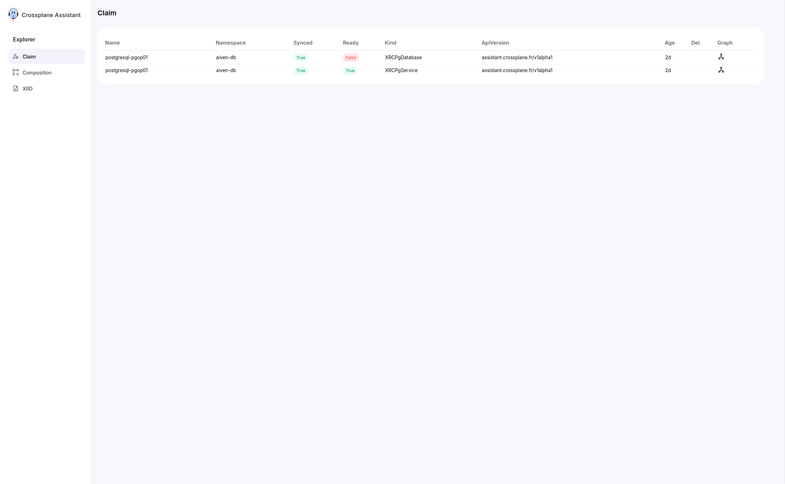
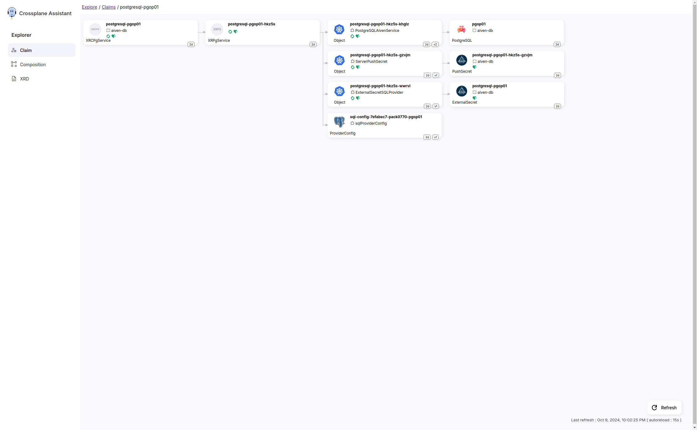
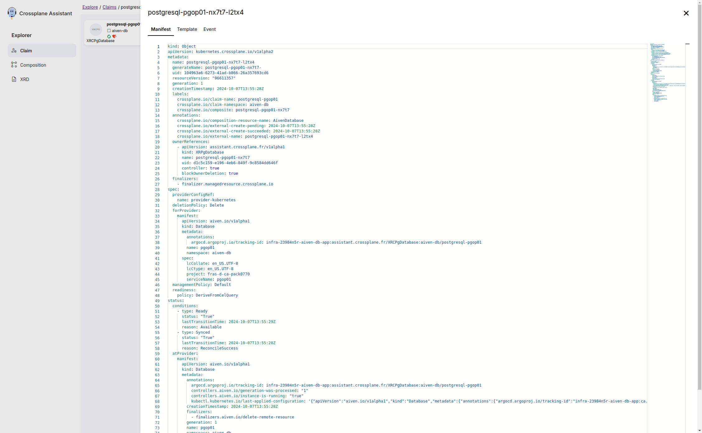
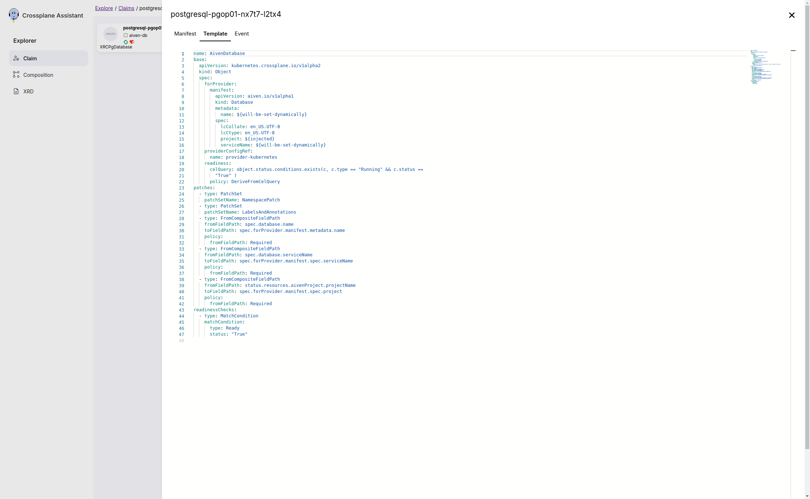
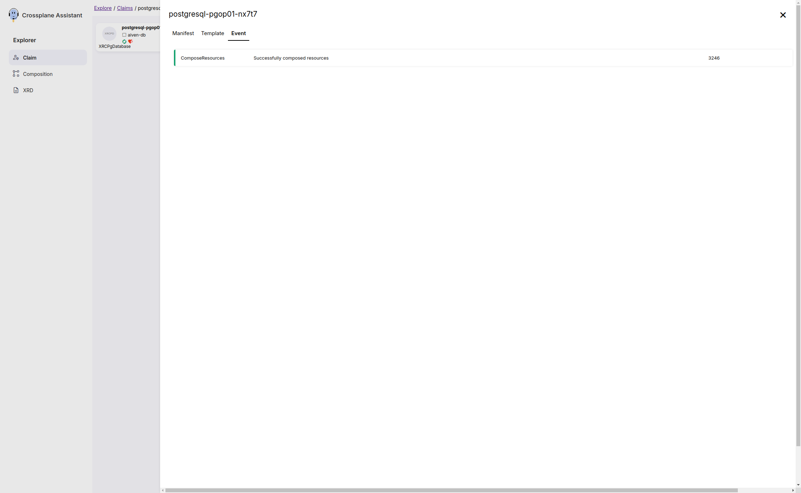

# Claims

## List View

The List view shows the claims in a table. The table shows the attributes:

* Claim name
* Sync status: Show if the claim is well integrated with the cluster
* Ready status: Show if the claim is successfully created and in a ready state
* Kubernetes Kind
* Kubernetes Group/Version
* Age
* Graph button: to see the claim in a graph view

The table is paginated and you can filter the claims by the claim name.

## Claim View

This view allow you to see the claim in a graph view. The graph is composed of objects, events and templates. The graph is interactive, you can click on the objects to see more details.

### Object Detail

The view of the objects in the graph is divided in three tabs: Manifest, Event and Template.

### Manifest Tab

The Tab Manifest shows the details of the object, including the dependencies.

### Template Tab

The Tab Template shows the template used to create the object.

### Event Tab

The Tab Event shows the events related to the object in the Cluster
