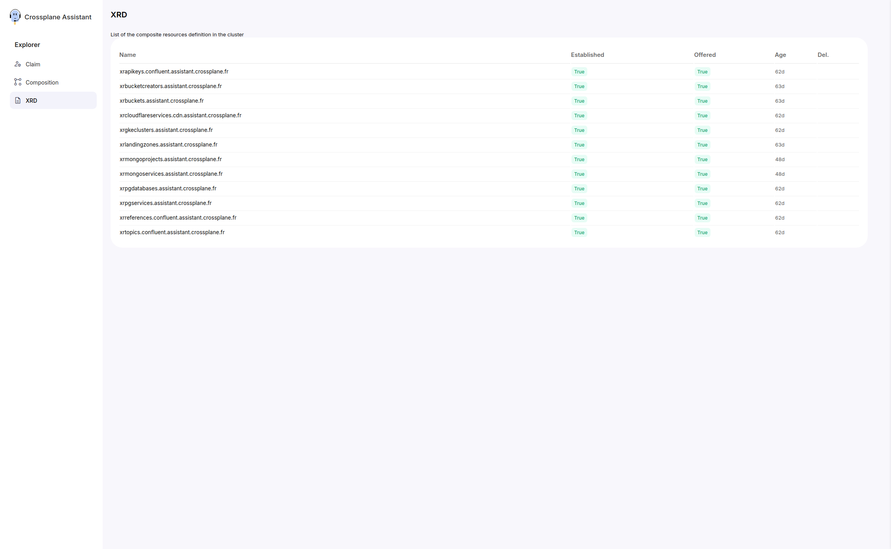
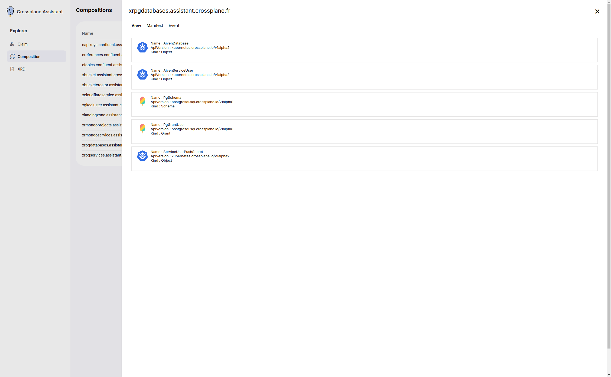
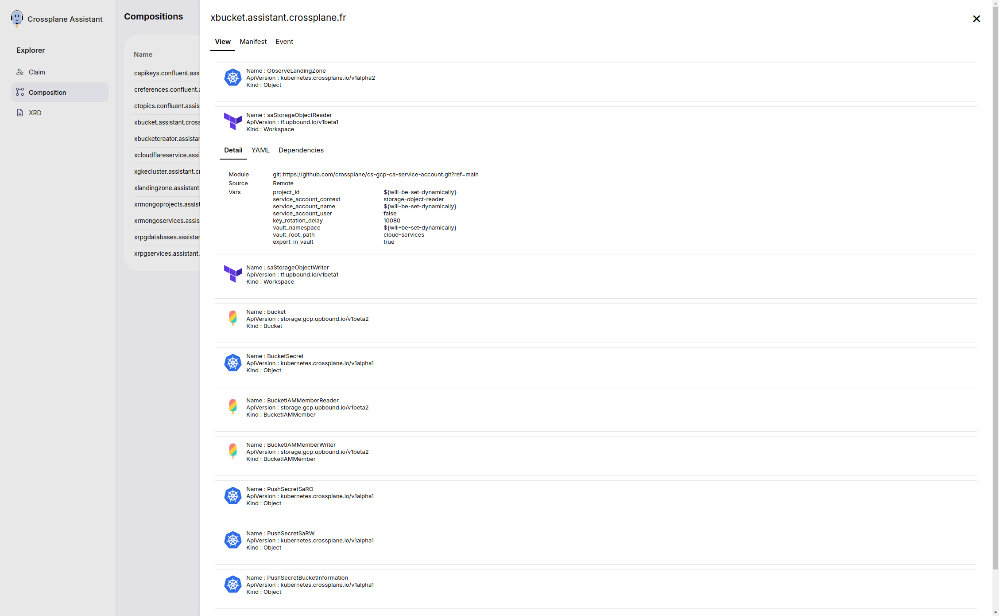
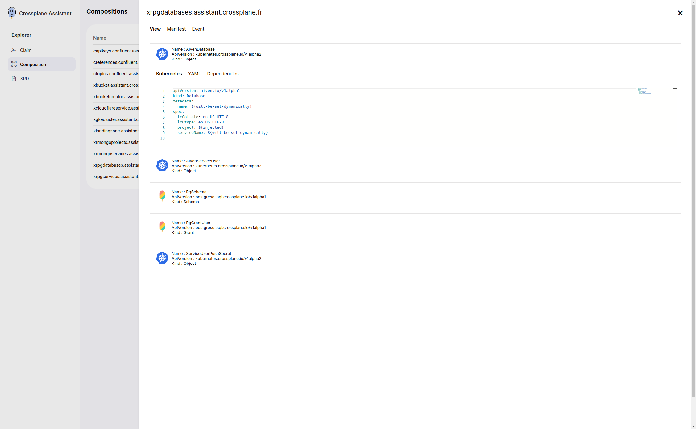
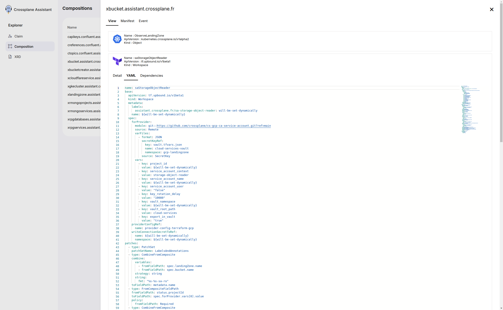
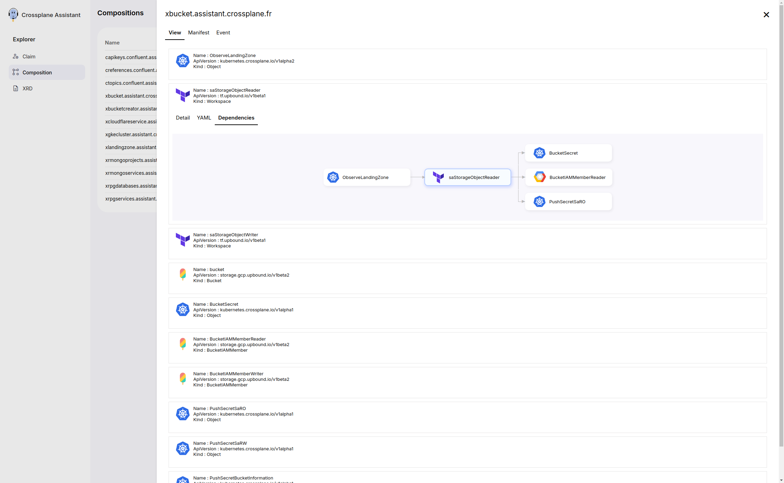
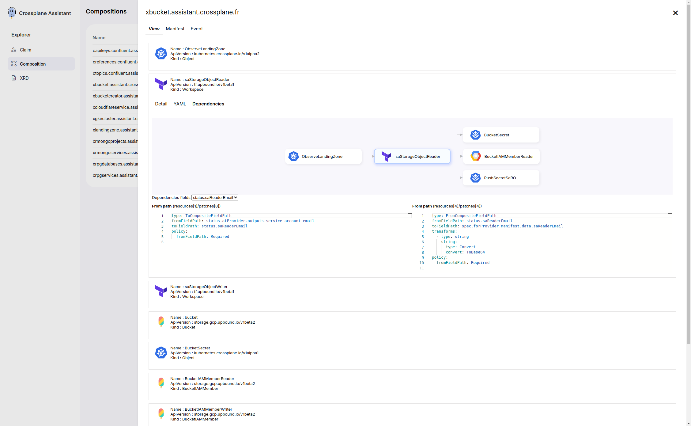
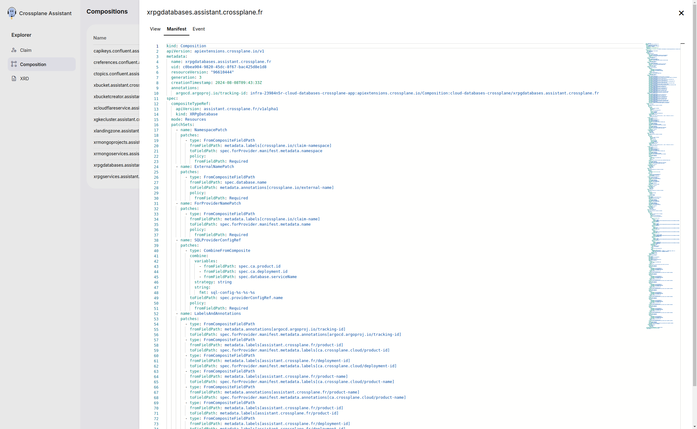

# Compositions

## List View

The List view shows the claims in a table. The table shows the attributes:

* Composition name
* Kubernetes Kind
* Age

The table is paginated and you can filter the compositions by the composition name.

## Composition View

### View Tab

The Details view allow you to see the composition in a graph view. The graph is composed of objects, events and templates. The graph is interactive, you can click on the objects to see more details.

#### Detail Subtab

The Subtab Detail sumup the information of the object in the Composition.

#### Kubernetes Subtab

The Subtab Kubernetes shows the Kubernetes YAML of the generated object.

#### YAML Subtab

The Subtab YAML shows the YAML of the object in the Composition.

#### Dependencies Subtab

##### Graph

The Subtab Dependencies shows the dependencies of the object in the Composition in a graph view.

##### Object interaction

The Subtab Dependencies shows the related code of the object in the Composition and the way it is composed across the objects.

### Manifest Tab

The view of the objects in the graph is divided in three tabs: Manifest, Event and Template.

