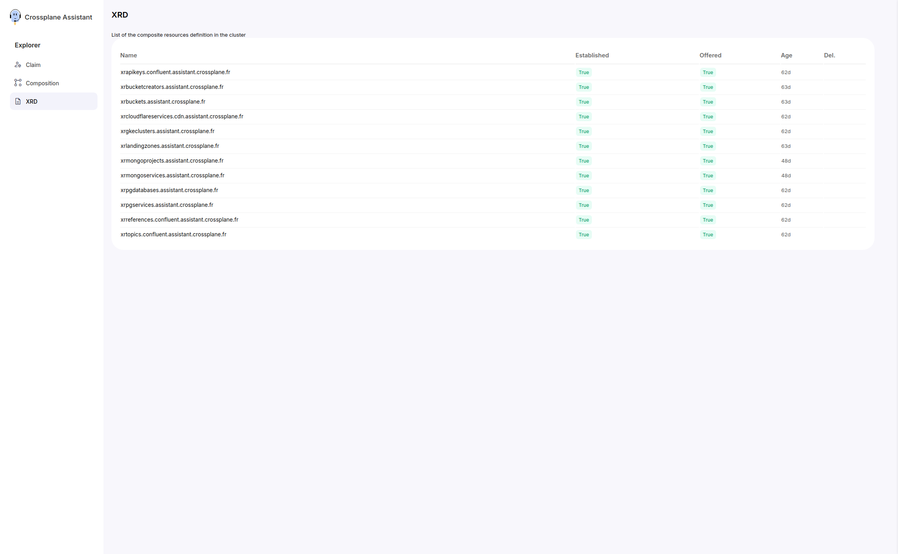

# XRDs

## List View

The List view shows the claims in a table. The table shows the attributes:

* XRD name
* Established: Show if the XRD is well integrated with the cluster
* Offered: Show if the XRD can process requests
* Age
